  

  
  
   

  

### About Me

A Software Engineering student, very curious and passionate about modern web applications and solving complex problems.

> 🎓 Pursuing a B.S. in Software Engineering.

> 📫 **How to reach me**: Check my <a style="text-decoration: underline;" href="#-social-media">Social Media links</a>

---

### Focus

- AI agents and intelligent automation
- Developer tools and productivity workflows
- Product-focused full-stack applications
- Modern web experiences with scalable architecture

---

### Tech Stack

<table style="width:100%; border-collapse:separate; border-spacing:20px; table-layout:fixed;">
  <tr>
    <td width="33%" align="center" style="width:33%; padding:24px; vertical-align:top;">
      <h3 style="margin: 0; border-bottom: 3px solid #b061ec; padding-bottom: 10px;">Daily Drivers</h3>
      
Used regularly

      

        
        
        
      

    </td>
    <td width="33%" align="center" style="width:33%; padding:24px; vertical-align:top;">
      <h3 style="margin: 0; border-bottom: 3px solid #ff79c6 ; padding-bottom: 10px;">Comfortable</h3>
      
Have experience with

      

        
        
        
        
        
        
      

        
    </td>
    <td width="33%" align="center" style="width:33%; padding:24px; vertical-align:top;">
      <h3 style="margin: 0; border-bottom: 3px solid 
       #50fa7b; padding-bottom: 10px;">Learning</h3>
      
Exploring & Growing

      

        
        
        
      

    </td>
  </tr>
</table>

---

### Selected Projects

**<a href="https://github.com/mronald-js/pymail-analyser" target="_blank" rel="noopener noreferrer">Pymail Analyser</a>**: An open-source tool designed to help you clean up and manage your email inbox. Through an intuitive interface, it analyzes "low-quality" senders (with high volume and low open rates), and allows you to take quick actions like archiving or bulk deleting messages..

---

  

  

  
  

  

### 🔗 Social Media

  
  
  

